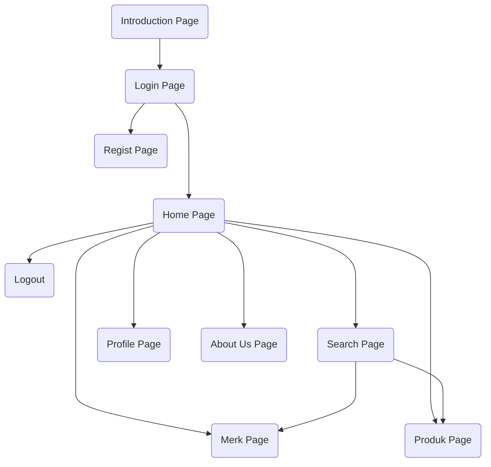

<!-- # lienna_bag

A new Flutter project.

## Getting Started

This project is a starting point for a Flutter application.

A few resources to get you started if this is your first Flutter project:

- [Lab: Write your first Flutter app](https://docs.flutter.dev/get-started/codelab)
- [Cookbook: Useful Flutter samples](https://docs.flutter.dev/cookbook)

For help getting started with Flutter development, view the
[online documentation](https://docs.flutter.dev/), which offers tutorials,
samples, guidance on mobile development, and a full API reference. -->

<!-- inspire README PROJECTS -->

<!-- https://github.com/ma-shamshiri/Spam-Detector/blob/master/README.md -->
<!-- https://github.com/aregtech/areg-sdk/blob/master/README.md -->

# Lienna Bag
### Kelompok 5 A1 Aplikasi Rekomendasi Tas

Projek Akhir - Praktikum Mobile

| NIM | NAMA | ROLE |
|------------|:----------------------:|:---------:|
| 2109106015 | Andi Nur Fadilah | `Anggota` |
| 2109106040 | Natalie Fuad | `Ketua` |
| 2109106044 | Riski Agung Romadhon | `Anggota` |
| 2109106050 | Sherina Laraswati | `Anggota` |
 

## Table Of Content
 - [Introduction](#introduction)
 - [Alur Program](#alur-program)
 - [Job Desk](#job-desk)
 - [Features](#features)
 - [Contributors](#contributors)

 

## Introduction
<!-- tentang aplikasi -->

 

## Job Desk

| NIM | NAMA | JOB DESK |
|-----|:--------------------:|:--------: |
| 2109106015 | Andi Nur Fadilah |`FE&BE Bag Details Page` `FE&BE About Us Page` `FE&BE User Profile Page`|
| 2109106050 | Natalie Fuad |`FE&BE Login Page` `FE&BE Regist Page`|
| 2109106044 | Riski Agung Romadhon |`FE&BE Search Page` `FE&BE Merk Page`|
| 2109106050 | Sherina Laraswati |`FE&BE Introduction Page` `FE&BE Home Page`|

 

## Alur Program

 

## Features

 

## Contributors
Silahkan baca [contributing guidlines](CONTRIBUTING.md) untuk panduan pembuatan projek dan informasi lainnya.

 

  
[Back To Top](top)

